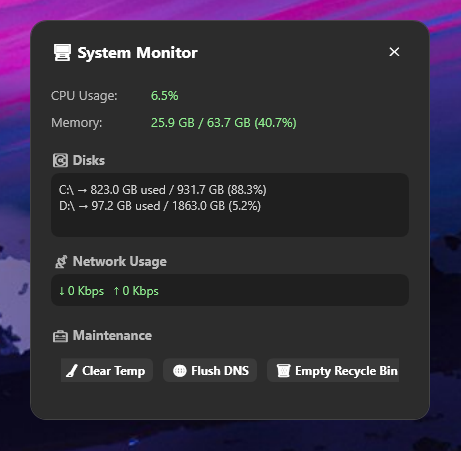

# 🖥️ TrayX

**TrayX** is a modern, lightweight system tray application for Windows that provides real-time monitoring of CPU, RAM, disk usage, and network activity.  
Built with WPF and .NET 8, it’s designed for IT professionals and power users who want clean system stats — always accessible, without clutter.

## 🖼 Screenshot



---

## ✨ Features

- 🔍 **Real-time stats** for CPU, memory, disks, and active network interface
- 🧰 **Quick maintenance** actions:
    - Clear temp folder
    - Flush DNS
    - Empty recycle bin
    - Clean RAM usage
- 🌐 Designed for future **remote admin dashboard integration**
- 📊 Historical graphs for CPU and RAM usage
- ⚙️ Configurable network interface, update interval, and optional auto-start
- 🚀 Runs silently from the **system tray**
- 🎨 Modern, minimalist UI (JetBrains-style)

---

## 📦 Technologies

- C# / WPF (.NET 8)
- Hardcodet.NotifyIcon.WPF (system tray)
- PerformanceCounter API
- Native Windows Shell32 interop
- MVVM-ready structure

---


## 🚀 Getting Started

```bash
git clone https://github.com/yourusername/TrayX.git
cd TrayX
dotnet build
dotnet run
```

🧑‍💻 License
TrayX is licensed under the [MIT License](LICENSE).
